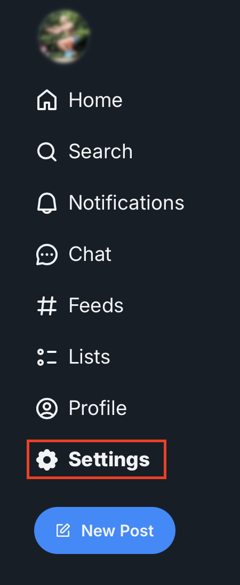
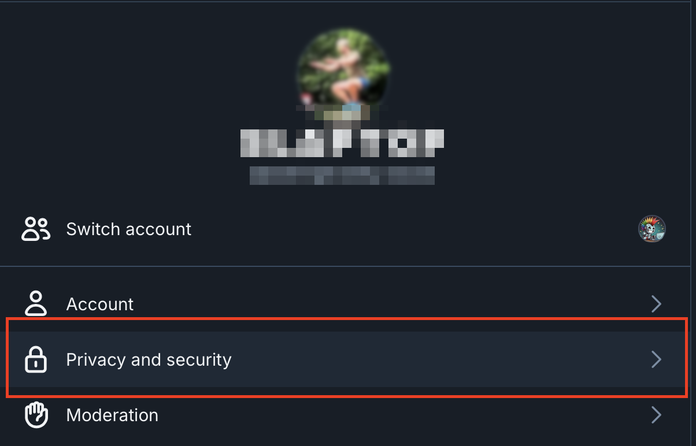
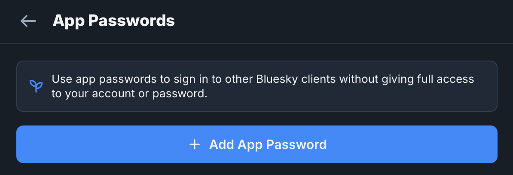
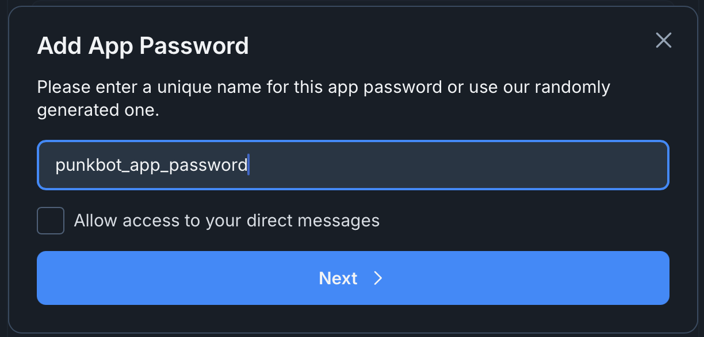

# punkbot 🤖


A simple bot for liking and re-posting posts on bluesky. Written in go-lang.

This bot is used by the account
[@iampunkbot](https://bsky.app/profile/iampunkbot.bsky.social) on bluesky.

## Concept

Punkbot is used re-post and like original posts (not replies to posts) that
match a one or more defined strings or hashtags.

In order to do this the bot connects to
[JetStream](https://docs.bsky.app/blog/jetstream), Bluesky's JSON firehose.
The bot scans all original posts and when a match if found it likes and re-posts
it.

The bot doesn't currently persist any data from Bluesky, but may record stats in
the future.

## How to compile

To compile you'll need a working go environment (check go.mod for the correct
version) and automake. You can run (the admittedly sparse) tests with:

```shell
make test
```

Building the binary can be done with:

```shell
make
```

## Running punkbot

In order to run `punkbot`, you'll need:

* A Bluesky account
* An app password for your bluesky account
* A completed configuration file
* To export your app password to the environment

### Create a Bluesky account

Head to [bsky.app](https://bsky.app/) and create a new account.

### Create an app password for your account

Once the new account is created, you must create an app password. This password
will be used to authenticate the punkbot app when it re-posts and likes content
on your behalf. To get an app password, login to [bsky.app](https://bsky.app),
click on `Settings` on the left hand side of the screen.



Then click on `Privacy and security`.



The click on `App passwords`


Then click on `Add App password` 



Select name for the password. Punkbot does not currently process DMs, so there's
no need allow access to direct messages.



The password will only be displayed once, so ensure you save it!

### Make a configuration file

Punkbot supports both yaml and json configuration files. By default, punkbot
will search the current directory for either `botcnf.yml` or `botcnf.json`.

The config consists of three elements

| Element | Type | Required | Description |
|:--------|:-----|:---------|:------------|
| Identifier | string | yes | The name of the bluesky account to post from |
| Terms | array of strings | yes | The terms the bot will search for |
| JetStreamServer | string | no | The name or IP address of the JetStream server to use |

The identifier can be a bluesky handle such as `@iampunkbot.bsky.social`.
However, it is possible to change handles and if this happens the bot will no
longer be able to authenticate. Therefore its recommended to use the account's
DID, which is a long-term identifier. An easy way to find a DID for an account
is with [this service](https://rmdes.github.io/).

The terms part is a simple a list of strings that the bot should search posts
for. This may be hashtags but can be any string. Don't worry about case, the
term text and post text are both converted to lowercase for comparison.

 **Be cafeful**, using terms that are too common will likely cause you problems.
Ensure you read [BlueSky's rate limit
policy](https://docs.bsky.app/docs/advanced-guides/rate-limits). Don't become a
spammer!

The JetStreamServer argument is optional. It can be used if you have your own
instance of JetStream or if you want to connect to a specific JetStream
instance. However, if don't know what a JetSteams server does and just want the
bot to work, simply leave this option out and the bot will select a public
JetStream server with the lowest latency.

Below, is a simple  YAML configuration for a bot.

```yaml
---
Identifier: iamapunkbot@bsky.app
Terms:
  - "#runningpunks"
  - "punkbot"
```

The above configuration will post as the account with the handle
`iamapunkbot@bsky.app` and will re-post and like any content that includes
"#runningpunks" or "punkbot". No JetStream server was present in the
configuration, so punkbot will connect to a public instance.

A JSON version of the same configuration can be found [here](docs/botcnf.json)

### Export the app password

Punkbot requires the app password or order to re-post and like content as the
desired user. The password must be exported to the shell using the variable
`PUNKBOT_PASSWORD`. For most shells, the variable can be set using the
following:

```shell
export PUNKBOT_PASSWORD='abcd-efgh-ijlk'
```

If no password is set, punkbot will fail and log the error.

#### Running punkbot

Once the password is set and the configuration file is prepared, it will be
possible to run the application.

Punkbot supports four command line flags:

| Flag | Argument | Description |
|:-----|:---------|:------------|
| -h | none | Print help and quit |
| -v | none | Print version and quit |
| -f | path to file | Specifies the location of configuration file, overrides the default |
| -l | string | Sets the logging level can be set to: `err`, `warn`, `info`(default) or `debug` | 

None of the command line arguments are mandatory.

Below is an example of running punkbot with `warn` level logging with a
non-standard configuration file:

```shell
./punkbot -l warn -f /tmp/myPbConfig.yml
```

## Feedback

I hope you find this project useful. Report any issues [the usual
way](https://github.com/mr-stringer/punkbot/issues). 