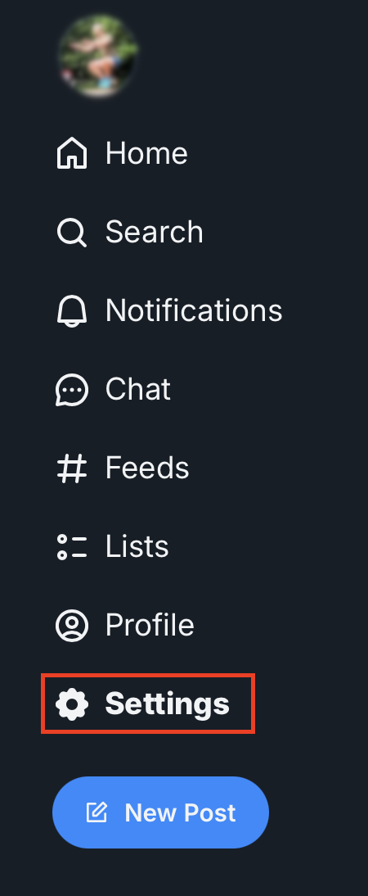
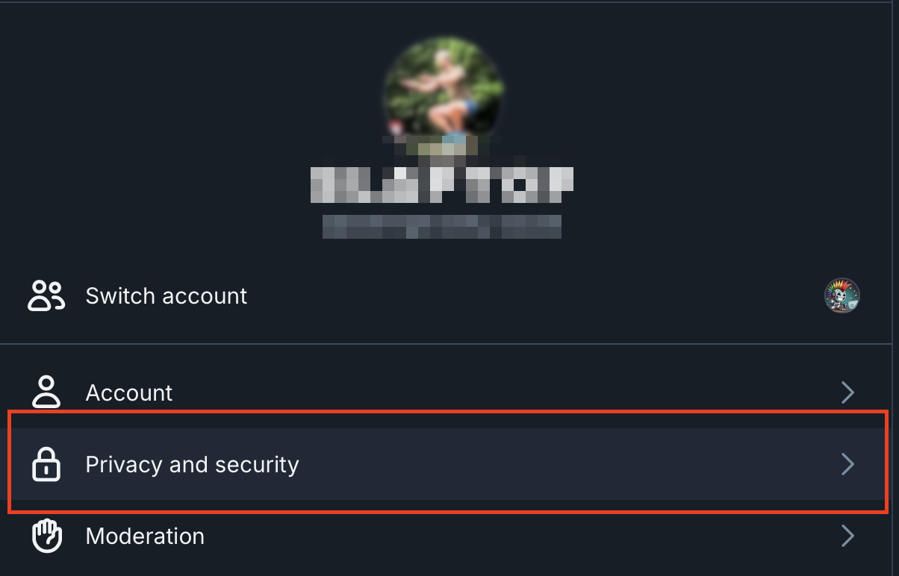

# Create an app password for your account

Once the new account is created, you must create an app password. This password
will be used to authenticate the punkbot app when it re-posts and likes content
on your behalf. To get an app password, login to [bsky.app](https://bsky.app),
click on `Settings` on the left hand side of the screen.

Then click on `Privacy and security`.

The click on `App passwords`

Then click on `Add App password` 

Select name for the password. Punkbot does not currently process DMs, so there's
no need allow access to direct messages.

The password will only be displayed once, so ensure you save it!